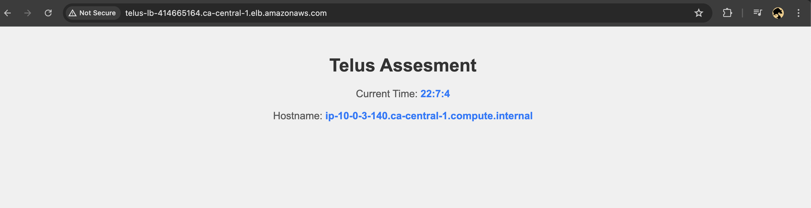
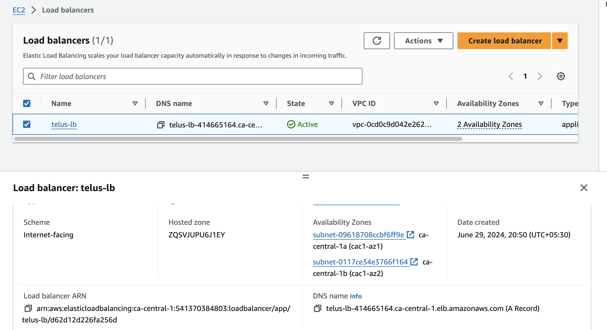
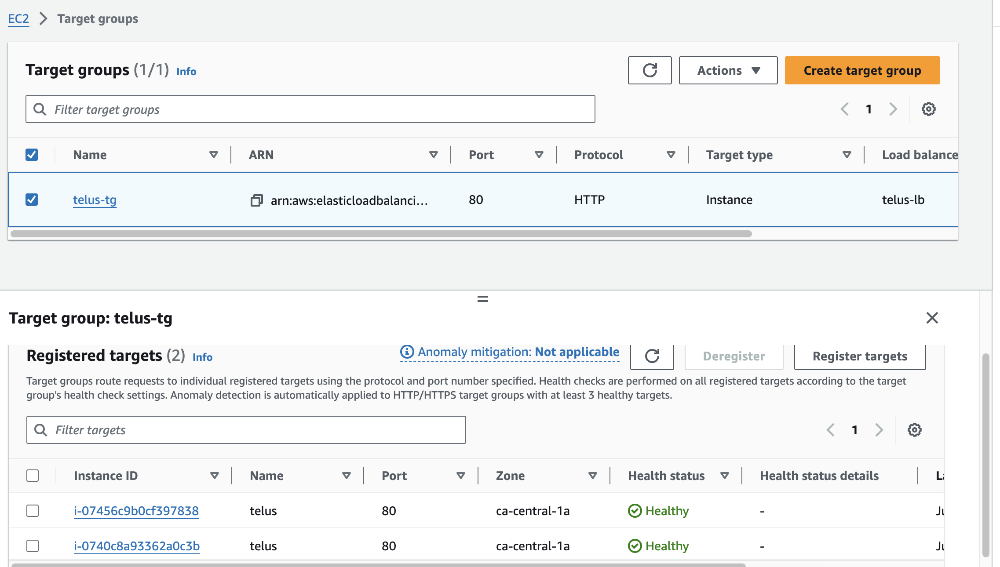
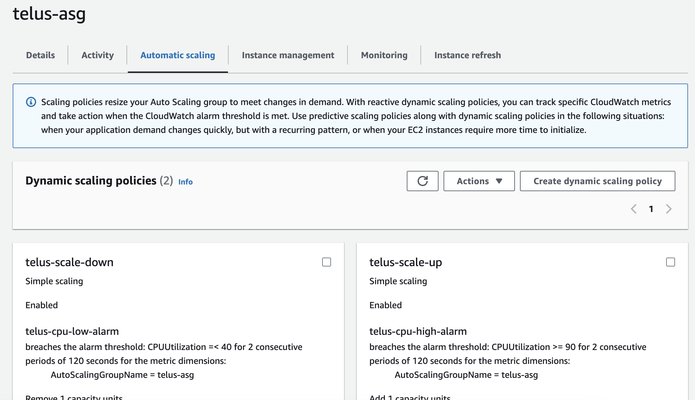
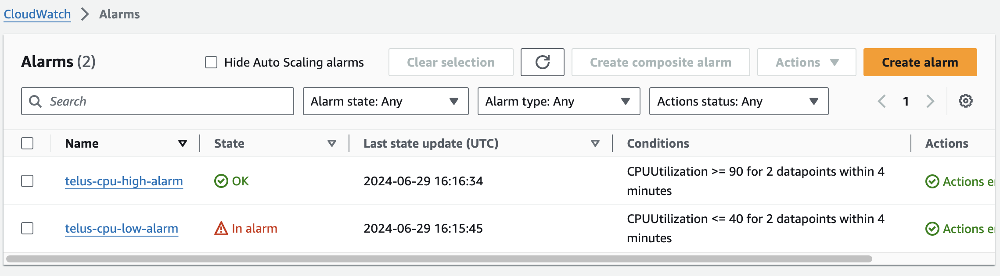

## Requirements

| Name | Version |
|------|---------|
|  [aws](#requirement\_aws) | 5.56.0 |

## Providers

| Name | Version |
|------|---------|
|  [aws](#provider\_aws) | 5.56.0 |

## Components

1. **EC2 Instance**: 
   - An Amazon EC2 instance is launched to host the webpage. 
   - It runs a user data script to set up the webpage content and start a web server on port 80.

2. **Auto Scaling Group (ASG)**: 
   - Configured to automatically adjust the number of EC2 instances based on traffic load.
   - Ensures high availability and fault tolerance.

3. **Load Balancer (LB)**: 
   - Distributes incoming traffic across multiple EC2 instances.
   - Improves the scalability and reliability of the application.

4. **CloudWatch Alarm**: 
   - Monitors the EC2 instance's CPU utilization.
   - If the CPU utilization exceeds a certain threshold (e.g., 90%), the alarm triggers an action, such as scaling up the ASG.

5. **User Data Script**: 
   - A Bash script (`user_data.sh`) is used as the user data when launching the EC2 instance.
   - This script generates the HTML content for the webpage and starts the web server.

6. **Web Server**: 
   - The EC2 instance runs a web server (e.g., `httpd` or `nginx`) to serve the webpage content on port 80.

7. **Webpage**: 
   - Displays the current timestamp and hostname of the EC2 instance in a simple HTML format.

## Traffic Flow

1. The user accesses the webpage by visiting the Load Balancer's DNS name in a web browser.
2. The Load Balancer receives the incoming traffic and distributes it across the EC2 instances in the Auto Scaling Group.
3. The Load Balancer uses a health check to ensure that only healthy EC2 instances receive traffic.
4. The EC2 instances receive the traffic and serve the webpage content to the user.

## Auto Scaling

1. The CloudWatch Alarm monitors the CPU utilization of the EC2 instances in the Auto Scaling Group.
2. If the CPU utilization of any EC2 instance exceeds the specified threshold (e.g., 90%), the CloudWatch Alarm triggers an action.
3. The Auto Scaling Group scales up by launching additional EC2 instances to handle the increased traffic.
4. The new EC2 instances are launched with the same user data script and configuration as the original EC2 instances.
5. The Load Balancer automatically detects the new EC2 instances and starts distributing traffic to them.
6. The Auto Scaling Group scales down (if necessary) based on the configured scaling policies and rules.

## Resources

| Name | Type |
|------|------|
| [aws_autoscaling_attachment.telus_asg_attachment](https://registry.terraform.io/providers/hashicorp/aws/5.56.0/docs/resources/autoscaling_attachment) | resource |
| [aws_autoscaling_group.telus](https://registry.terraform.io/providers/hashicorp/aws/5.56.0/docs/resources/autoscaling_group) | resource |
| [aws_autoscaling_policy.telus_scale_down](https://registry.terraform.io/providers/hashicorp/aws/5.56.0/docs/resources/autoscaling_policy) | resource |
| [aws_autoscaling_policy.telus_scale_up](https://registry.terraform.io/providers/hashicorp/aws/5.56.0/docs/resources/autoscaling_policy) | resource |
| [aws_cloudwatch_metric_alarm.telus_cpu_high](https://registry.terraform.io/providers/hashicorp/aws/5.56.0/docs/resources/cloudwatch_metric_alarm) | resource |
| [aws_cloudwatch_metric_alarm.telus_cpu_low](https://registry.terraform.io/providers/hashicorp/aws/5.56.0/docs/resources/cloudwatch_metric_alarm) | resource |
| [aws_eip.telus_nat_eip1](https://registry.terraform.io/providers/hashicorp/aws/5.56.0/docs/resources/eip) | resource |
| [aws_eip.telus_nat_eip2](https://registry.terraform.io/providers/hashicorp/aws/5.56.0/docs/resources/eip) | resource |
| [aws_iam_instance_profile.telus](https://registry.terraform.io/providers/hashicorp/aws/5.56.0/docs/resources/iam_instance_profile) | resource |
| [aws_iam_role.telus](https://registry.terraform.io/providers/hashicorp/aws/5.56.0/docs/resources/iam_role) | resource |
| [aws_internet_gateway.telus_igw](https://registry.terraform.io/providers/hashicorp/aws/5.56.0/docs/resources/internet_gateway) | resource |
| [aws_launch_template.telus](https://registry.terraform.io/providers/hashicorp/aws/5.56.0/docs/resources/launch_template) | resource |
| [aws_lb.telus_lb](https://registry.terraform.io/providers/hashicorp/aws/5.56.0/docs/resources/lb) | resource |
| [aws_lb_listener.telus_lb_listener](https://registry.terraform.io/providers/hashicorp/aws/5.56.0/docs/resources/lb_listener) | resource |
| [aws_lb_target_group.telus](https://registry.terraform.io/providers/hashicorp/aws/5.56.0/docs/resources/lb_target_group) | resource |
| [aws_nat_gateway.telus_nat_gw1](https://registry.terraform.io/providers/hashicorp/aws/5.56.0/docs/resources/nat_gateway) | resource |
| [aws_nat_gateway.telus_nat_gw2](https://registry.terraform.io/providers/hashicorp/aws/5.56.0/docs/resources/nat_gateway) | resource |
| [aws_route.telus_private_rt_nat](https://registry.terraform.io/providers/hashicorp/aws/5.56.0/docs/resources/route) | resource |
| [aws_route_table.telus_private_rt](https://registry.terraform.io/providers/hashicorp/aws/5.56.0/docs/resources/route_table) | resource |
| [aws_route_table.telus_public_rt](https://registry.terraform.io/providers/hashicorp/aws/5.56.0/docs/resources/route_table) | resource |
| [aws_route_table_association.private_rt_assoc](https://registry.terraform.io/providers/hashicorp/aws/5.56.0/docs/resources/route_table_association) | resource |
| [aws_route_table_association.telus_public_rt1_assoc](https://registry.terraform.io/providers/hashicorp/aws/5.56.0/docs/resources/route_table_association) | resource |
| [aws_route_table_association.telus_public_rt2_assoc](https://registry.terraform.io/providers/hashicorp/aws/5.56.0/docs/resources/route_table_association) | resource |
| [aws_security_group.telus_ec2](https://registry.terraform.io/providers/hashicorp/aws/5.56.0/docs/resources/security_group) | resource |
| [aws_security_group.telus_lb](https://registry.terraform.io/providers/hashicorp/aws/5.56.0/docs/resources/security_group) | resource |
| [aws_subnet.telus_private_subnet](https://registry.terraform.io/providers/hashicorp/aws/5.56.0/docs/resources/subnet) | resource |
| [aws_subnet.telus_public_subnet1](https://registry.terraform.io/providers/hashicorp/aws/5.56.0/docs/resources/subnet) | resource |
| [aws_subnet.telus_public_subnet2](https://registry.terraform.io/providers/hashicorp/aws/5.56.0/docs/resources/subnet) | resource |
| [aws_vpc.telus](https://registry.terraform.io/providers/hashicorp/aws/5.56.0/docs/resources/vpc) | resource |
| [aws_iam_policy_document.assume_role](https://registry.terraform.io/providers/hashicorp/aws/5.56.0/docs/data-sources/iam_policy_document) | data source |

## Inputs

| Name | Description | Type | Default | Required |
|------|-------------|------|---------|:--------:|
|  [ami\_id](#input\_ami\_id) | AMI ID of the EC2 instance | `string` | `"ami-0654ca17e4d49cdb4"` | no |
|  [instance\_type](#input\_instance\_type) | Instance type of the EC2 instance | `string` | `"t3.micro"` | no |
|  [name](#input\_name) | Name of the resources to be created | `string` | `"Telus"` | no |
|  [tags\_all](#input\_tags\_all) | Map of tags which applies to all the resources | `map(string)` | <pre>{   "Name": "Telus",   "Purpose": "Assesment" }</pre> | no |

## Outputs

| Name | Description |
|------|-------------|
|  [ec2\_security\_group\_id](#output\_ec2\_security\_group\_id) | Security Group ID of the EC2 Instance |
|  [lb\_dns\_name](#output\_lb\_dns\_name) | DNS Name of the Load Balancer |
|  [lb\_security\_group\_id](#output\_lb\_security\_group\_id) | Security Group ID of the Load Balancer |
|  [telus\_nat\_eip1](#output\_telus\_nat\_eip1) | Elastic IP of the NAT Gateway |
|  [telus\_nat\_eip2](#output\_telus\_nat\_eip2) | Elastic IP of the NAT Gateway |
|  [telus\_private\_subnet](#output\_telus\_private\_subnet) | Private Subnet ID |
|  [telus\_public\_subnet1](#output\_telus\_public\_subnet1) | Public Subnet 1 ID |
|  [telus\_public\_subnet2](#output\_telus\_public\_subnet2) | Public Subnet 2 ID |

## LoadBalancer DNS : http://telus-lb-414665164.ca-central-1.elb.amazonaws.com

## Screenshots

**Webpage Output**

**Load Balancer**

**Target Group**

**AutoScaling Group**

**Cloudwatch Alarms for AutoScaling Group**
